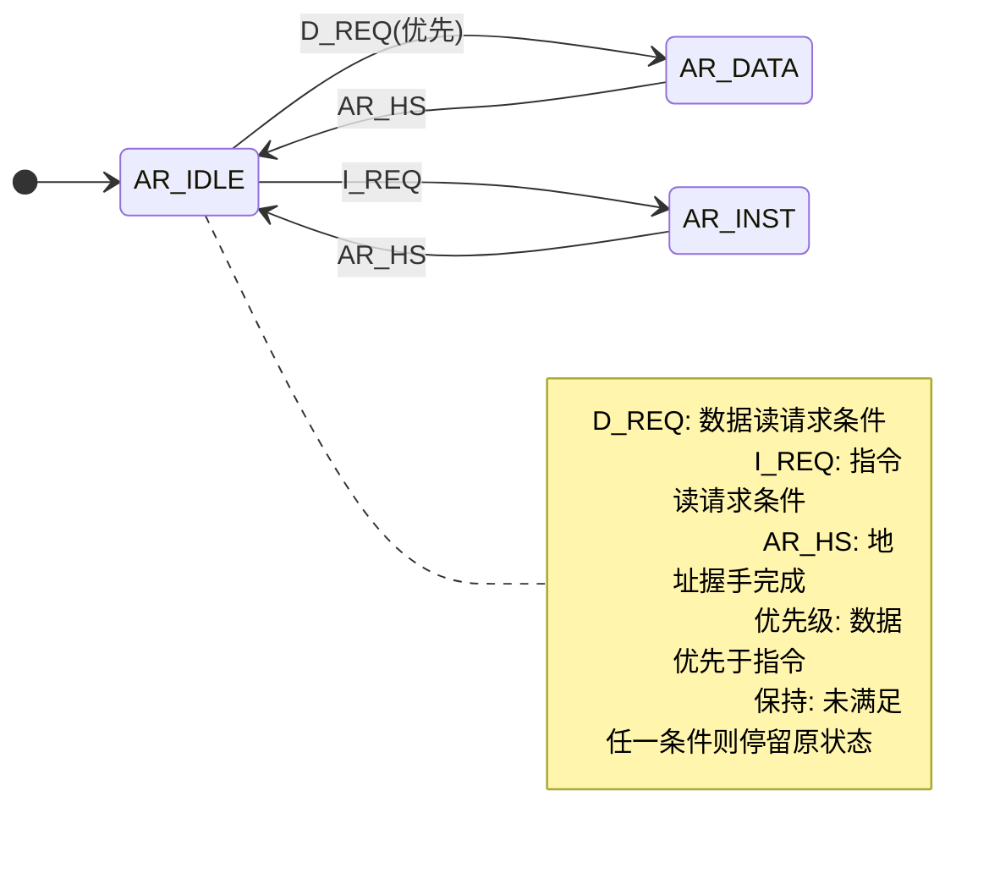
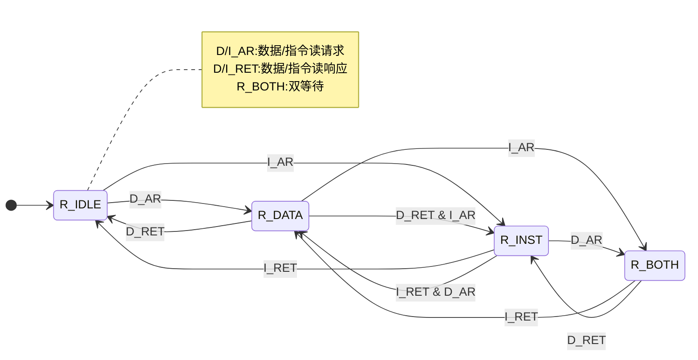
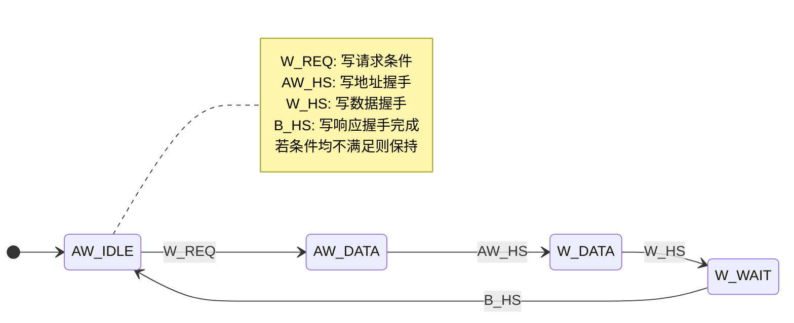
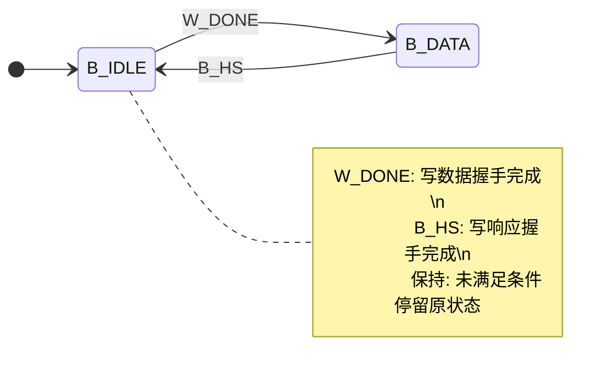

# EXP15: 添加类 SRAM 总线- AXI 总线转接桥

## 状态机状态转移

### 1. 读请求
#### AR 状态机

状态说明:
- `AR_IDLE`: 等待新的读请求 (指令或数据)。
- `AR_DATA`: 等待读数据请求握手。
- `AR_INST`: 等待指令请求握手。
- 转回 `AR_IDLE` 的条件是该次地址握手 `arvalid && arready` 成功。

额外说明
- **指令和数据读请求优先级**: `AR_IDLE` 状态, 在判断时先检测数据读再检测指令读.
- **为避免读写冲突而采取阻塞**: `AR_IDLE` 状态, 为避免读请求发出时有相同的写事务还未完成, 使得读请求读不到写进去的值, 使用`ar_block`信号阻塞.
### 2. 读响应

状态说明:
- `R_IDLE`: 无在途响应。
- `R_DATA` / `R_INST`: 等待一种响应, 可再发起另一类读入双等待.
- `R_BOTH`: 等待两类响应; 指令先到转 `R_DATA`, 数据先到转 `R_INST`.

额外说明:
- 允许指令和数据读同时等待, 但不允许有多个同类别的读同时等待, 通过两个 `outstanding` 寄存器实现.
- 指令/数据返回的同一周期, 有数据/指令请求, 允许转移到 `R_DATA` / `R_INST`.
### 3. 写请求

状态说明:
- `AW_IDLE`: 等待写请求。
- `AW_DATA`: 地址握手阶段。
- `W_DATA`: 写数据拍阶段。
- `W_WAIT`: 等待 B 响应完成。

### 4. 写响应

状态说明:
- `B_IDLE`: 无在途写响应。
- `B_DATA`: 等待写响应握手完成。

---

### 5.设计上的考量
**为什么不考虑有在途读响应的情况下, 再发出写对读数据的影响?**
**答:** AXI 协议的可见性保证了, 在读握手成功的情况下, 该读事务看到的是写前的快照.

**为什么不考虑读请求发出后会再发出写请求?**
**答:** CPU设计时不会出现有读请求未握手成功就发出写请求的情况.

**为什么 AR 状态机不同时等待指令和数据的读地址握手?**
**答:** ~~懒. exp16可以改改看.~~

**类 sram 允许在 `valid` 有效后 `ready` 有效前变更信号, 但 AXI协议不允许, 如何解决?**
**答:** 加缓存, 当转接桥觉得自己可以处理类 sram 请求时, 就将采样的那个周期的数据缓存下来, 如何拿着缓存中的数据与 AXI 总线交互, 直到下次处理时再变更缓存里的值. 缓存举例: `wstrb_reg`, `awaddr_reg`, `wdata_reg`, `wstrb_reg`, `data_size_reg`等.

---
### 缩写速查
| 缩写 | 含义 |
|------|------|
| D_REQ | 数据读请求条件 |
| I_REQ | 指令读请求条件 |
| AR_HS | 读地址握手完成 |
| D_AR / I_AR | 数据/指令读地址握手事件 |
| D_RET / I_RET | 数据/指令读响应握手事件 |
| W_REQ | 写请求条件 (data_req && data_wr) |
| AW_HS | 写地址握手完成 |
| W_HS | 写数据握手完成 |
| B_HS | 写响应握手完成 |
| W_DONE | 写数据阶段结束 (进入等待响应) |

